---
title: "HW3"
author: "Taylor Thul"
date: "February 14, 2017"
output:
  html_document: default
  word_document: default
---

White Wine Data Report: Data Exploration and Multiple Linear Regression Model Fitting


Run some summary statistics: 


```r
> numSummary(White_wines[,c("alcohol", "chlorides", "citric.acid", "density", 
+   "fixed.acidity", "free.sulfur.dioxide", "pH", "quality", "residual.sugar", 
+   "sulphates", "total.sulfur.dioxide", "volatile.acidity")], 
+   statistics=c("mean", "sd", "IQR", "quantiles"), quantiles=c(0,.25,.5,.75,1))
```

```
                             mean           sd        IQR      0%
alcohol               10.51426705  1.230620568  1.9000000 8.00000
chlorides              0.04577517  0.021849312  0.0140000 0.00900
citric.acid            0.33423116  0.121000333  0.1200000 0.00000
density                0.99402738  0.002990907  0.0043775 0.98711
fixed.acidity          6.85470792  0.843711217  1.0000000 3.80000
free.sulfur.dioxide   35.30916888 17.008704869 23.0000000 2.00000
pH                     3.18826664  0.151000600  0.1900000 2.72000
quality                5.87790935  0.885638575  1.0000000 3.00000
residual.sugar         6.39096386  5.072477513  8.2000000 0.60000
sulphates              0.48984688  0.114125834  0.1400000 0.22000
total.sulfur.dioxide 138.36065741 42.498064554 59.0000000 9.00000
volatile.acidity       0.27824076  0.100804838  0.1100000 0.08000
                             25%       50%      75%      100%    n NA
alcohol                9.5000000  10.40000  11.4000  14.20000 4898  0
chlorides              0.0360000   0.04300   0.0500   0.34600 4897  1
citric.acid            0.2700000   0.32000   0.3900   1.66000 4897  1
density                0.9917225   0.99374   0.9961   1.03898 4898  0
fixed.acidity          6.3000000   6.80000   7.3000  14.20000 4896  2
free.sulfur.dioxide   23.0000000  34.00000  46.0000 289.00000 4897  1
pH                     3.0900000   3.18000   3.2800   3.82000 4898  0
quality                5.0000000   6.00000   6.0000   9.00000 4898  0
residual.sugar         1.7000000   5.20000   9.9000  65.80000 4897  1
sulphates              0.4100000   0.47000   0.5500   1.08000 4898  0
total.sulfur.dioxide 108.0000000 134.00000 167.0000 440.00000 4898  0
volatile.acidity       0.2100000   0.26000   0.3200   1.10000 4897  1
```

So the main variables we are looking at include alcohol, chlorides, citric acid, density, fixed acidity, free sulfur dioxide, pH, residual sugar, sulfates, total sulfur dioxide, and volatile acidity. We want to know how each of these variables influence the variable 'quality.' 

Make sure no data is missing:


```r
> sapply(White_wines, function(x)(sum(is.na(x)))) 
```

```
       fixed.acidity     volatile.acidity          citric.acid 
                   2                    1                    1 
      residual.sugar            chlorides  free.sulfur.dioxide 
                   1                    1                    1 
total.sulfur.dioxide              density                   pH 
                   0                    0                    0 
           sulphates              alcohol              quality 
                   0                    0                    0 
               group 
                   0 
```

```r
> # NA counts
```
No missing data! Hooray!

Now to explore each variable individually. 

Firstly let us look at the variable of interest, quality:

```r
> with(White_wines, Hist(quality, scale="frequency", breaks="Sturges", col="red"))
> #add lables
> title (main= "Quality of Wine/ Preference")
```

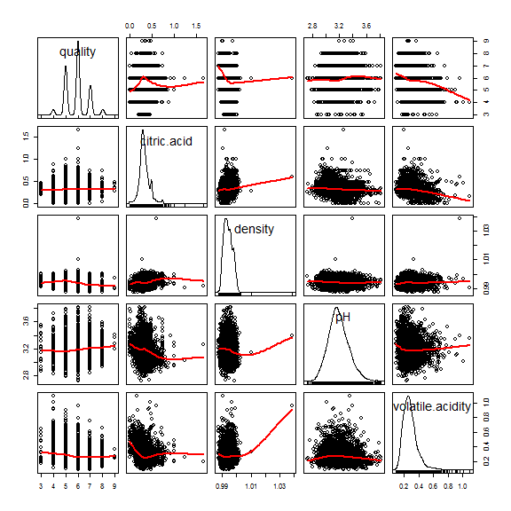

Based on this histogram the data appears fairly normally distributed.

Since this is the variable of interest we will also use other visual means of exploring the data:


```r
> Boxplot( ~ quality, data=White_wines, id.method="y")
```

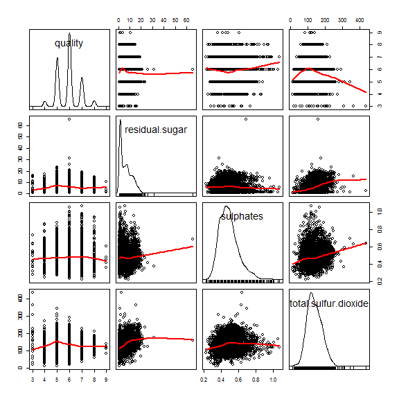

```
 [1] "252"  "254"  "295"  "446"  "741"  "874"  "1035" "1230" "1418" "1485"
[11] "775"  "821"  "828"  "877"  "1606" "18"   "21"   "23"   "69"   "75"  
```

From the box plot we can see there are a few outliers which will need to be kept in mind during analysis.


Now look at alcohol:

```r
> with(White_wines, Hist(alcohol, scale="frequency", breaks="Sturges", col="green"))
> 
> #add lables
> title(main="Histogram of Alcohol % By Volume") 
```

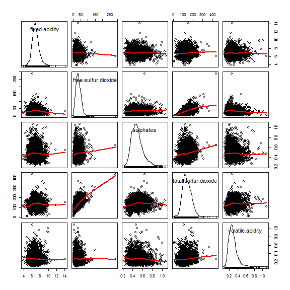

Fairly normal distribution with few outliers. 

Chlorides:

```r
> with(White_wines, Hist(chlorides, scale="frequency", breaks="Sturges", col="purple"))
> title(main="Chlorides in Wine")
```

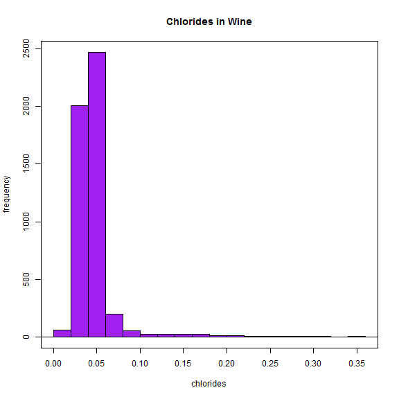

This appears to be skewed and have some outliers so I will do a box plot


```r
> Boxplot( ~ quality, data=White_wines, id.method="y")
```

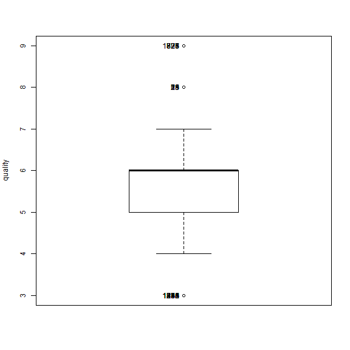

```
 [1] "252"  "254"  "295"  "446"  "741"  "874"  "1035" "1230" "1418" "1485"
[11] "775"  "821"  "828"  "877"  "1606" "18"   "21"   "23"   "69"   "75"  
```

Citric Acid:

```r
> with(White_wines, Hist(citric.acid, scale="frequency", breaks="Sturges", col="orange"))
> title (main= "Citric Acid in Wine")
```

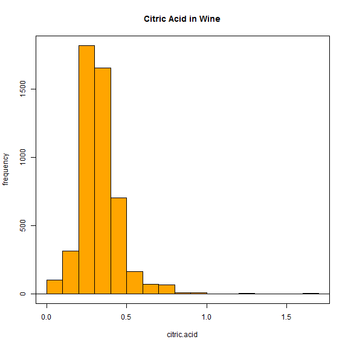

```r
> scatterplot(quality~citric.acid, reg.line=FALSE, smooth=FALSE, spread=FALSE, boxplots=FALSE, 
+   span=0.5, ellipse=FALSE, levels=c(.5, .9), data=White_wines)
```

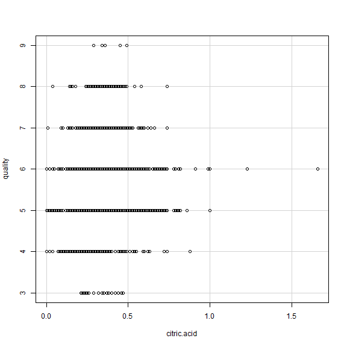

```r
> Boxplot( ~ citric.acid, data=White_wines, id.method="y")
```

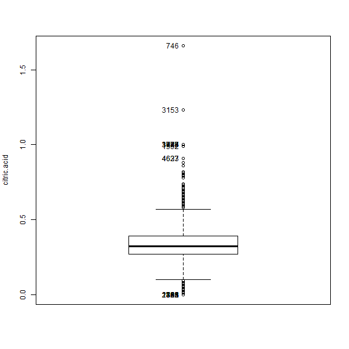

```
 [1] "116"  "301"  "303"  "781"  "863"  "865"  "891"  "1153" "1818" "2322"
[11] "746"  "3153" "947"  "1723" "1776" "3044" "3498" "1552" "4627" "4633"
```

Citric acid also appears to have quite a few outliers and some newness. 

Density

```r
> with(White_wines, Hist(density, scale="frequency", breaks="Sturges", col="yellow"))
> title(main= "Density in Wine")
```

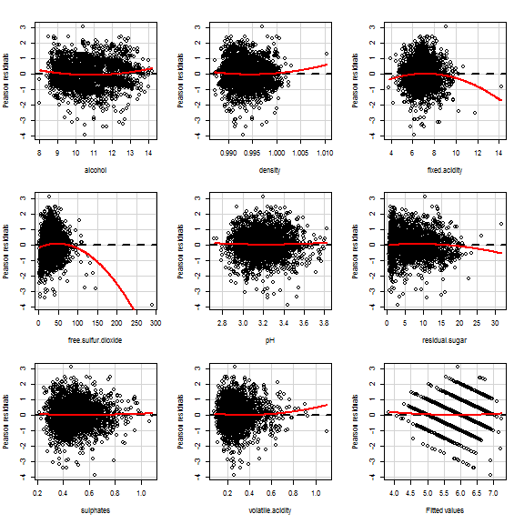

Density also appears to have a skew with outliers to the right.  I'm noting most of the skewness is to the left so I am now wondering if perhaps these variables are correlated. I will explore this later after the individual variables.  

Fixed acidity

```r
> with(White_wines, Hist(fixed.acidity, scale="frequency", breaks="Sturges", col="pink"))
> title(main="Fixed Acidity in Wine")
```

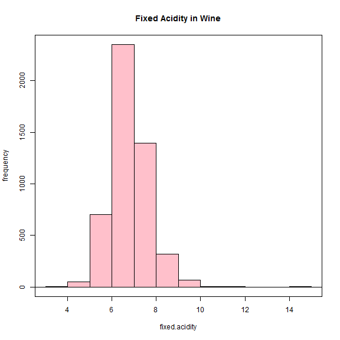

```r
> #using a dotplot
> with(White_wines, Dotplot(fixed.acidity, bin=FALSE))
```

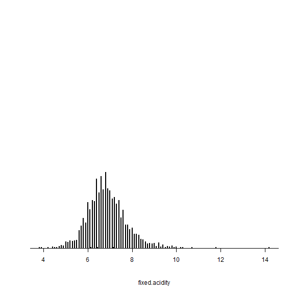

```r
> Boxplot( ~ fixed.acidity, data=White_wines, id.method="y")
```

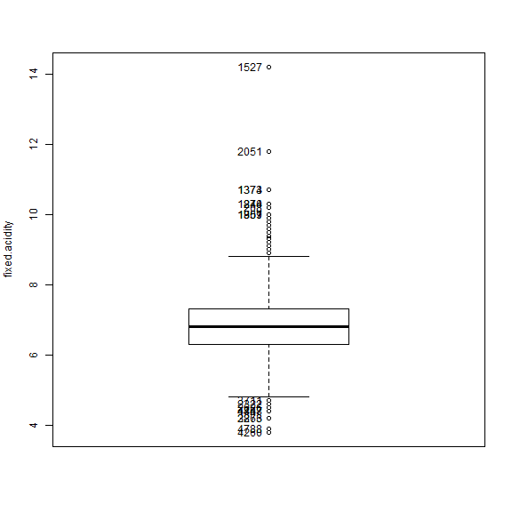

```
 [1] "4260" "4788" "2873" "3266" "4447" "4787" "4848" "2626" "2322" "3711"
[11] "1527" "2051" "1373" "1374" "874"  "1240" "208"  "359"  "1857" "1901"
```
Again outliers noted so a box plot reviewed. 

Free sulfur dioxide:

```r
> with(White_wines, Hist(free.sulfur.dioxide, scale="frequency", breaks="Sturges", col="brown"))
> title(main="Free Sulfur Dioxide in Wine")
```

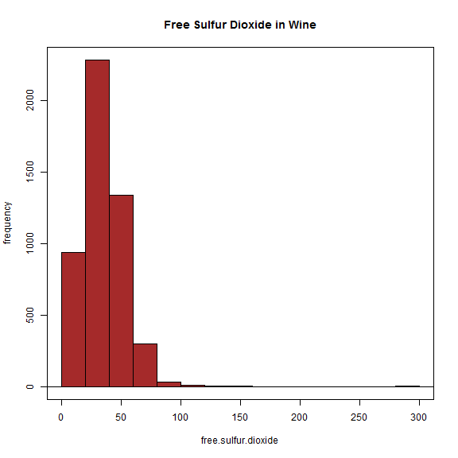

```r
> #using a dotplot
> with(White_wines, Dotplot(free.sulfur.dioxide, bin=FALSE))
```

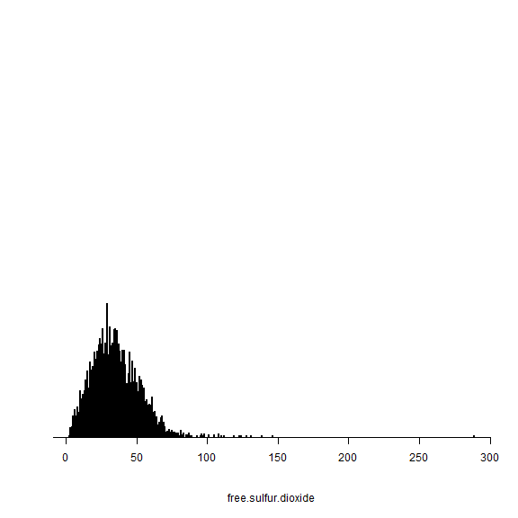

```r
> Boxplot( ~ free.sulfur.dioxide, data=White_wines, id.method="y")
```

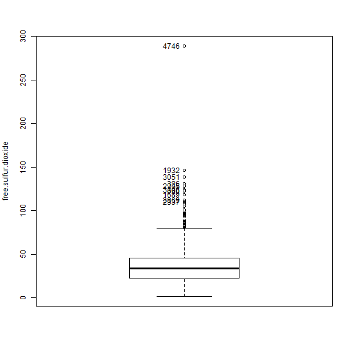

```
 [1] "4746" "1932" "3051" "326"  "2335" "3308" "660"  "1689" "3869" "2337"
```

```r
> #trying a density plot
> densityPlot( ~ free.sulfur.dioxide, data=White_wines, bw="SJ", adjust=1, kernel="gaussian")
```

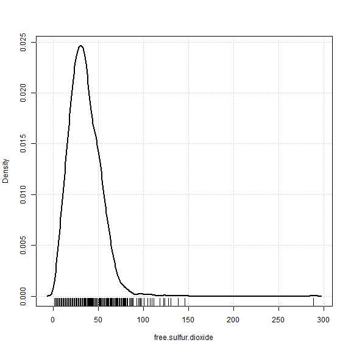


pH:


```r
> with(White_wines, Hist(pH, scale="frequency", breaks="Sturges", col="blue"))
> title(main="pH level in Wine")
```

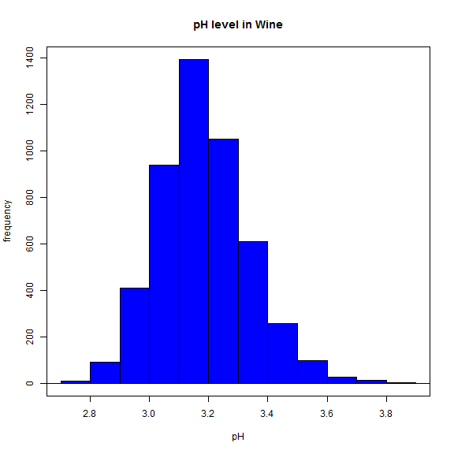

```r
> Boxplot( ~ pH, data=White_wines, id.method="y")
```

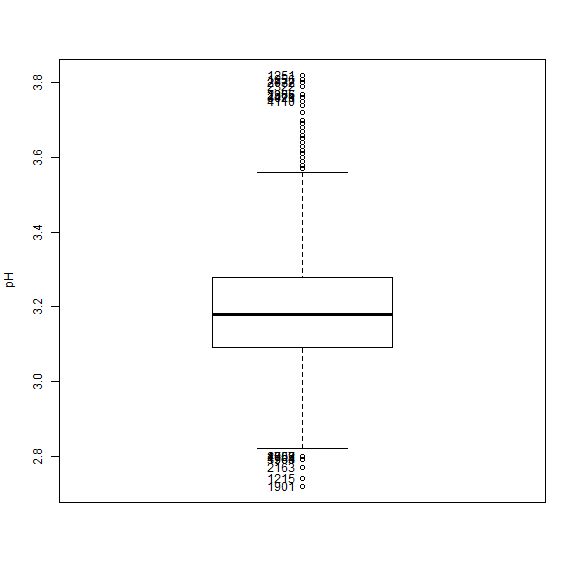

```
 [1] "1215" "1759" "1901" "1960" "1961" "2163" "2957" "3763" "4602" "1251"
[11] "1256" "2037" "2772" "2322" "1386" "2965" "3026" "4471" "4110"
```
pH appears to have less outliers and overall more even distribution than the variables previous.  

Residual sugar:


```r
> with(White_wines, Hist(residual.sugar, scale="frequency", breaks="Sturges", col="ivory"))
> title(main="Residual Sugar in Wine")
```

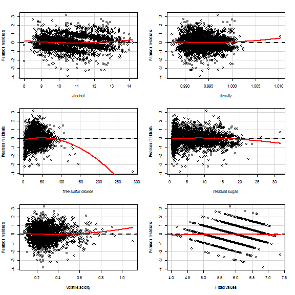

```r
> Boxplot( ~ residual.sugar, data=White_wines, id.method="y")
```

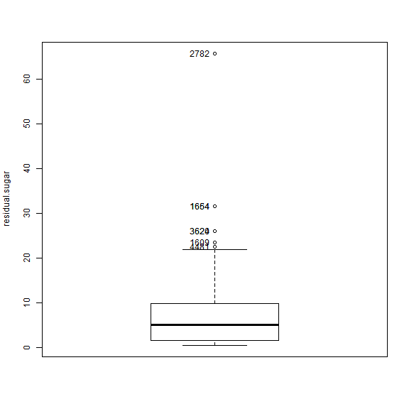

```
[1] "1609" "1654" "1664" "2782" "3620" "3624" "4481"
```
Continuing the trend of large outliers. 

Sulphates:
I am interested especially in this variable as I have read the level of sulphates influences the taste of wine.  I will see if the data supports that in this case. 


```r
> with(White_wines, Hist(sulphates, scale="frequency", breaks="Sturges", col="magenta"))
> title(main="Free Sulfur Dioxide in Wine")
```

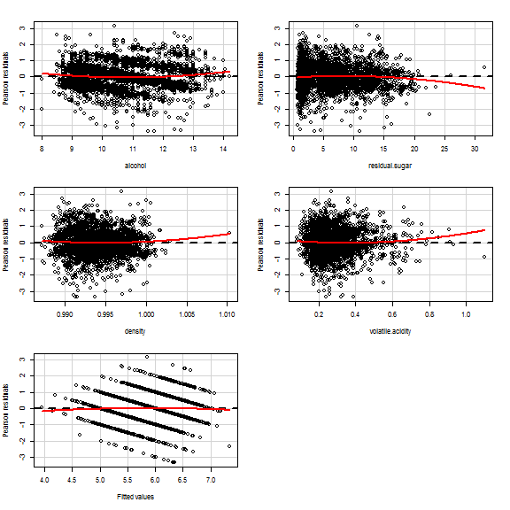

```r
> #using a dotplot
> with(White_wines, Dotplot(sulphates, bin=FALSE))
```

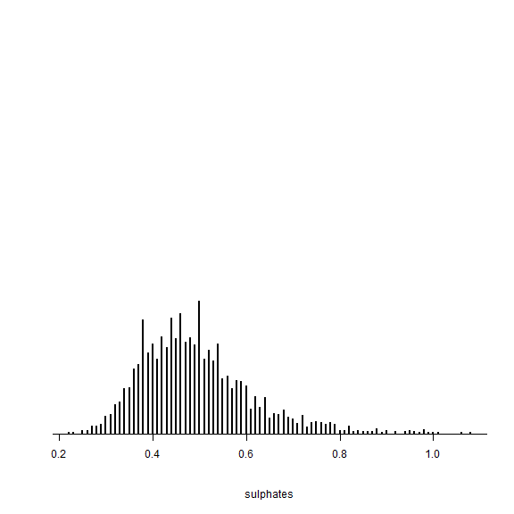

```r
> Boxplot( ~ sulphates, data=White_wines, id.method="y")
```

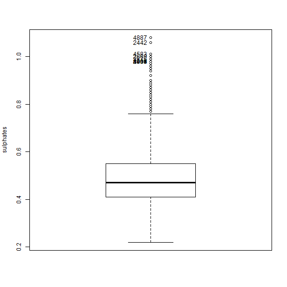

```
 [1] "4887" "2442" "4583" "2669" "2875" "2404" "3999" "4000" "4001" "4013"
```
Still some skew and outliers to the right but appears more evenly distributed.  


Total sulfur dixoide:
I anticipate this may be related to free sulfur dioxide so will keep in mind to test later. 


```r
> with(White_wines, Hist(total.sulfur.dioxide, scale="frequency", breaks="Sturges", col="limegreen"))
> title(main="Total Sulfur Dioxide in Wine")
```

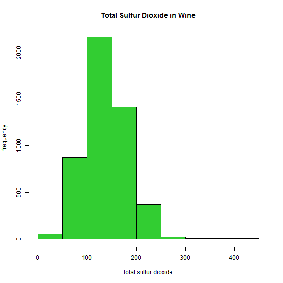

```r
> #using a dotplot
> with(White_wines, Dotplot(total.sulfur.dioxide, bin=FALSE))
```

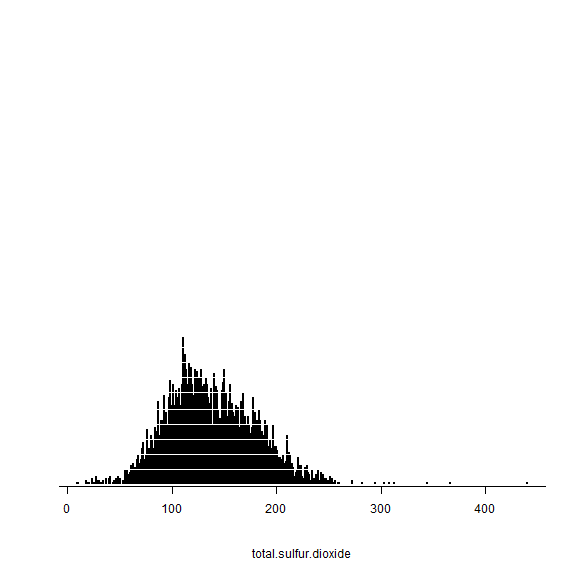

```r
> Boxplot( ~ total.sulfur.dioxide, data=White_wines, id.method="y")
```

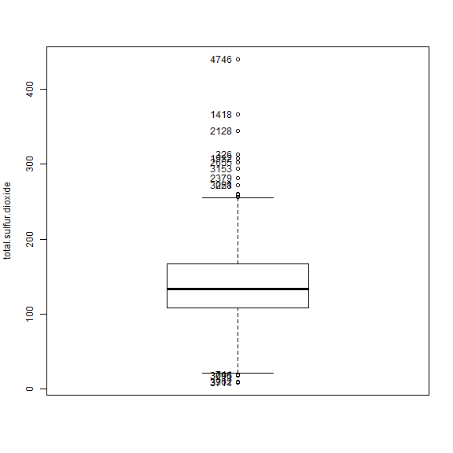

```
 [1] "741"  "3095" "3096" "3711" "3902" "4746" "1418" "2128" "326"  "1932"
[11] "2655" "3153" "2379" "228"  "3051"
```


Volatile acidity:


```r
> with(White_wines, Hist(volatile.acidity, scale="frequency", breaks="Sturges", col="lightblue"))
> title(main="Volatile Acidity in Wine")
```

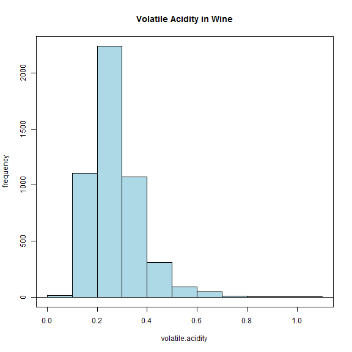

```r
> Boxplot( ~ volatile.acidity, data=White_wines, id.method="y")
```

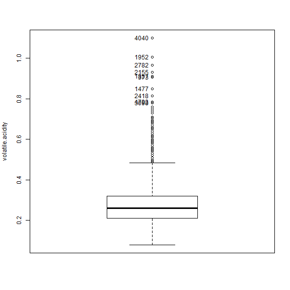

```
 [1] "4040" "1952" "2782" "2155" "1857" "373"  "1477" "2418" "4793" "3098"
```

```r
> densityPlot( ~ volatile.acidity, data=White_wines, bw="SJ", adjust=1, kernel="gaussian")
```

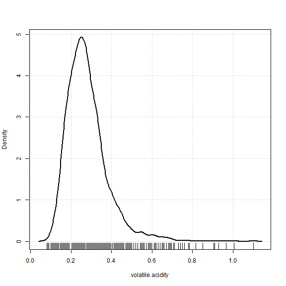

The trend continues...

Now I want to look at how these variables might be related to each other.  


```r
> install.packages("sm")
```

```
Installing package into 'C:/Users/tthul/Documents/R/win-library/3.3'
(as 'lib' is unspecified)
```

```
package 'sm' successfully unpacked and MD5 sums checked

The downloaded binary packages are in
	C:\Users\tthul\AppData\Local\Temp\RtmpgTi5Hy\downloaded_packages
```

```r
> library(sm)
```

```
Package 'sm', version 2.2-5.4: type help(sm) for summary information
```

```r
> sm.density.compare(White_wines$total.sulfur.dioxide, White_wines$volatile.acidity)
```

```
missing data are removed
missing data are removed
missing data are removed
missing data are removed
missing data are removed
missing data are removed
missing data are removed
missing data are removed
missing data are removed
missing data are removed
missing data are removed
missing data are removed
missing data are removed
missing data are removed
missing data are removed
missing data are removed
missing data are removed
missing data are removed
missing data are removed
missing data are removed
missing data are removed
missing data are removed
missing data are removed
missing data are removed
missing data are removed
missing data are removed
missing data are removed
missing data are removed
missing data are removed
missing data are removed
missing data are removed
missing data are removed
missing data are removed
missing data are removed
missing data are removed
missing data are removed
missing data are removed
missing data are removed
missing data are removed
missing data are removed
missing data are removed
missing data are removed
missing data are removed
missing data are removed
missing data are removed
missing data are removed
missing data are removed
missing data are removed
missing data are removed
missing data are removed
missing data are removed
missing data are removed
missing data are removed
missing data are removed
missing data are removed
missing data are removed
missing data are removed
missing data are removed
missing data are removed
missing data are removed
missing data are removed
missing data are removed
missing data are removed
missing data are removed
missing data are removed
missing data are removed
missing data are removed
missing data are removed
missing data are removed
missing data are removed
missing data are removed
missing data are removed
missing data are removed
missing data are removed
missing data are removed
missing data are removed
missing data are removed
missing data are removed
missing data are removed
missing data are removed
missing data are removed
missing data are removed
missing data are removed
missing data are removed
missing data are removed
missing data are removed
missing data are removed
missing data are removed
missing data are removed
missing data are removed
missing data are removed
missing data are removed
missing data are removed
missing data are removed
missing data are removed
missing data are removed
missing data are removed
missing data are removed
missing data are removed
missing data are removed
missing data are removed
missing data are removed
missing data are removed
missing data are removed
missing data are removed
missing data are removed
missing data are removed
missing data are removed
missing data are removed
missing data are removed
missing data are removed
missing data are removed
missing data are removed
missing data are removed
missing data are removed
missing data are removed
missing data are removed
missing data are removed
missing data are removed
missing data are removed
missing data are removed
missing data are removed
missing data are removed
missing data are removed
missing data are removed
missing data are removed
```

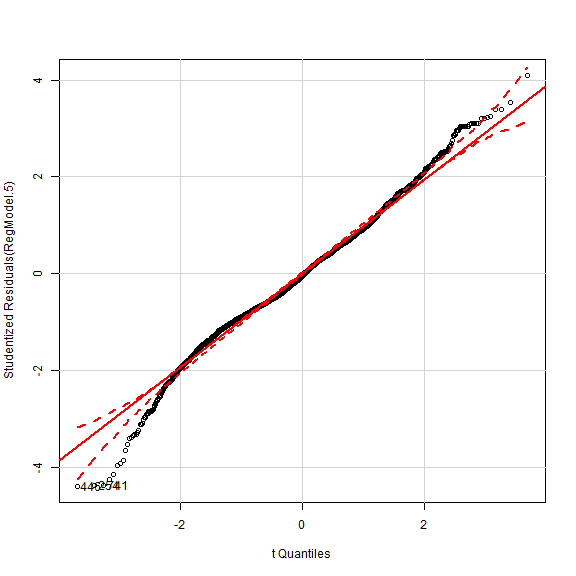

```r
> #this didn't work with this data set but I want to keep it in the code for another time, they must be in a dataframe to use
```

Compare chlorides, citric acid, density, and volatile acidity to see any relationship:

```r
> scatterplotMatrix(~chlorides+citric.acid+density+volatile.acidity, reg.line=FALSE, 
+   smooth=TRUE, spread=FALSE, span=0.5, ellipse=FALSE, levels=c(.5, .9), id.n=0, diagonal = 
+   'density', data=White_wines)
```

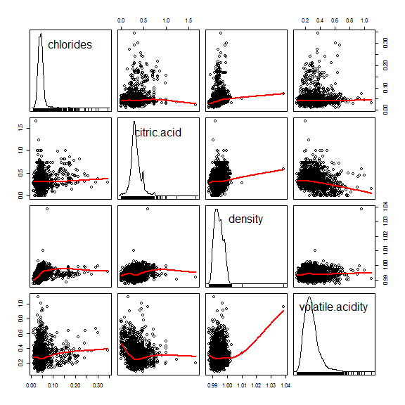

There don't seem to be any associations standing out from this comparison.  This makes sense because the distribution of the data in all these variables was quite similar.  

Look at how some variables may be associated with the variable of interest, quality. 


```r
> scatterplotMatrix(~alcohol+chlorides+quality+fixed.acidity+free.sulfur.dioxide, reg.line=FALSE, smooth=TRUE,
+    spread=FALSE, span=0.5, ellipse=FALSE, levels=c(.5, .9), id.n=0, diagonal = 'density', 
+   data=White_wines)
```

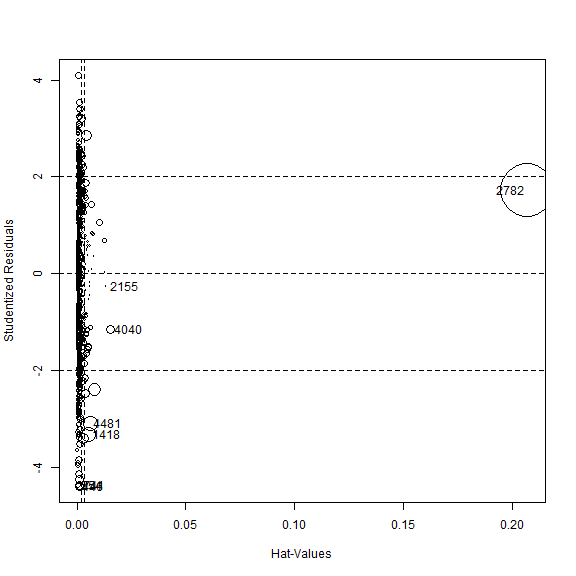
There appear to be some weak associations between quality and fixed acidity as well as free sulfur dioxide.


```r
> scatterplotMatrix(~quality+citric.acid+density+pH+volatile.acidity, reg.line=FALSE, 
+   smooth=TRUE, spread=FALSE, span=0.5, ellipse=FALSE, levels=c(.5, .9), id.n=0, diagonal = 
+   'density', data=White_wines)
```


No strong associations stand out except a small negative between quality and volatile acidity and a posity between density and volatile acidity.  

One more scatter plot matrix to capture all the variables.


```r
> scatterplotMatrix(~quality+residual.sugar+sulphates+total.sulfur.dioxide, reg.line=FALSE, 
+   smooth=TRUE, spread=FALSE, span=0.5, ellipse=FALSE, levels=c(.5, .9), id.n=0, diagonal = 
+   'density', data=White_wines)
```

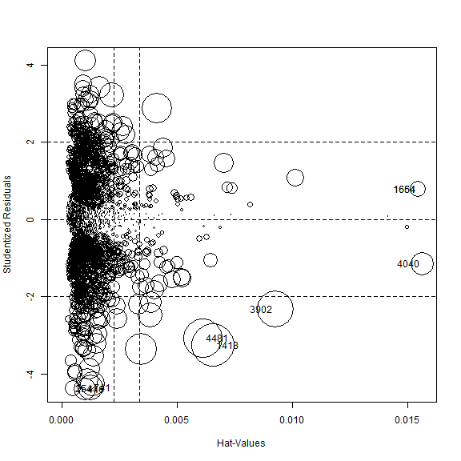
A slight negative association is seen between quality and total sulfur dioxide as well as a slight positive relationship between sulphates and total sulfar dioxide, which makes sense.  

A quick exploration between variables with similar names to see any relationship before further analysis


```r
> scatterplotMatrix(~fixed.acidity+free.sulfur.dioxide+sulphates+total.sulfur.dioxide+volatile.acidity,
+    reg.line=FALSE, smooth=TRUE, spread=FALSE, span=0.5, ellipse=FALSE, levels=c(.5, .9), 
+   id.n=0, diagonal = 'density', data=White_wines)
```


Some positive association are seen indicating they may be highly related.  

Now lets look at how all the might go together to predict preference ('quality').
First I will split the data into a training and test data set to ensure the model fits well. 


```r
> # divide the dataset into a training and a testing set based on a random uniform number on fixed seed, which in this case we are using the date
> # this step is also creating a new variable and adding it to the data set which is a distribution of random numbers from 0 to 1 
> 
> set.seed(20170214)
> White_wines$group <- runif(length(White_wines$quality), min = 0, max = 1)
> 
> #what random forests do is this process over and over again and makes the aggregate which might be called bootstrapping?
> 
> White_wines.train <- subset(White_wines, group <= 0.90)
> White_wines.test <- subset(White_wines, group > 0.90)
> 
> #see if it worked
> summary(White_wines.train)
```

```
 fixed.acidity    volatile.acidity  citric.acid     residual.sugar  
 Min.   : 3.800   Min.   :0.0800   Min.   :0.0000   Min.   : 0.600  
 1st Qu.: 6.300   1st Qu.:0.2100   1st Qu.:0.2700   1st Qu.: 1.700  
 Median : 6.800   Median :0.2600   Median :0.3200   Median : 5.100  
 Mean   : 6.851   Mean   :0.2784   Mean   :0.3338   Mean   : 6.342  
 3rd Qu.: 7.300   3rd Qu.:0.3200   3rd Qu.:0.3900   3rd Qu.: 9.800  
 Max.   :14.200   Max.   :1.1000   Max.   :1.6600   Max.   :65.800  
 NA's   :2        NA's   :1        NA's   :1        NA's   :1       
   chlorides       free.sulfur.dioxide total.sulfur.dioxide
 Min.   :0.00900   Min.   :  3.00      Min.   :  9.0       
 1st Qu.:0.03600   1st Qu.: 23.00      1st Qu.:108.0       
 Median :0.04300   Median : 34.00      Median :134.0       
 Mean   :0.04574   Mean   : 35.28      Mean   :138.3       
 3rd Qu.:0.05000   3rd Qu.: 46.00      3rd Qu.:167.0       
 Max.   :0.34600   Max.   :289.00      Max.   :440.0       
 NA's   :1         NA's   :1                               
    density             pH         sulphates         alcohol     
 Min.   :0.9871   Min.   :2.72   Min.   :0.2200   Min.   : 8.00  
 1st Qu.:0.9917   1st Qu.:3.09   1st Qu.:0.4100   1st Qu.: 9.50  
 Median :0.9937   Median :3.18   Median :0.4700   Median :10.40  
 Mean   :0.9940   Mean   :3.19   Mean   :0.4892   Mean   :10.52  
 3rd Qu.:0.9960   3rd Qu.:3.28   3rd Qu.:0.5500   3rd Qu.:11.40  
 Max.   :1.0390   Max.   :3.82   Max.   :1.0800   Max.   :14.20  
                                                                 
    quality          group          
 Min.   :3.000   Min.   :0.0002833  
 1st Qu.:5.000   1st Qu.:0.2285282  
 Median :6.000   Median :0.4596618  
 Mean   :5.879   Mean   :0.4570277  
 3rd Qu.:6.000   3rd Qu.:0.6859608  
 Max.   :9.000   Max.   :0.8998507  
                                    
```

```r
> summary(White_wines.test)
```

```
 fixed.acidity    volatile.acidity  citric.acid     residual.sugar  
 Min.   : 5.000   Min.   :0.0800   Min.   :0.0000   Min.   : 0.800  
 1st Qu.: 6.400   1st Qu.:0.2175   1st Qu.:0.2600   1st Qu.: 2.100  
 Median : 6.800   Median :0.2600   Median :0.3200   Median : 6.300  
 Mean   : 6.889   Mean   :0.2766   Mean   :0.3387   Mean   : 6.866  
 3rd Qu.: 7.300   3rd Qu.:0.3200   3rd Qu.:0.3900   3rd Qu.:10.400  
 Max.   :10.200   Max.   :1.0050   Max.   :0.8800   Max.   :22.000  
   chlorides       free.sulfur.dioxide total.sulfur.dioxide
 Min.   :0.01400   Min.   :  2.0       Min.   : 24.0       
 1st Qu.:0.03675   1st Qu.: 23.0       1st Qu.:108.0       
 Median :0.04300   Median : 35.0       Median :135.0       
 Mean   :0.04612   Mean   : 35.6       Mean   :139.4       
 3rd Qu.:0.05000   3rd Qu.: 47.0       3rd Qu.:170.2       
 Max.   :0.20400   Max.   :124.0       Max.   :260.0       
    density             pH          sulphates        alcohol     
 Min.   :0.9877   Min.   :2.770   Min.   :0.280   Min.   : 8.40  
 1st Qu.:0.9918   1st Qu.:3.080   1st Qu.:0.400   1st Qu.: 9.40  
 Median :0.9941   Median :3.170   Median :0.480   Median :10.20  
 Mean   :0.9942   Mean   :3.174   Mean   :0.496   Mean   :10.45  
 3rd Qu.:0.9964   3rd Qu.:3.260   3rd Qu.:0.560   3rd Qu.:11.30  
 Max.   :1.0010   Max.   :3.690   Max.   :1.010   Max.   :13.90  
    quality          group       
 Min.   :3.000   Min.   :0.9001  
 1st Qu.:5.000   1st Qu.:0.9229  
 Median :6.000   Median :0.9528  
 Mean   :5.872   Mean   :0.9506  
 3rd Qu.:6.000   3rd Qu.:0.9758  
 Max.   :8.000   Max.   :0.9993  
```

```r
> #I think it worked! 
```

I will use the train data to fit the model and the test data to analysis the fit.


```r
> RegModel.1 <- 
+   lm(quality~alcohol+chlorides+citric.acid+density+fixed.acidity+free.sulfur.dioxide+pH+residual.sugar+sulphates+total.sulfur.dioxide+volatile.acidity,
+    data=White_wines.train)
> summary(RegModel.1)
```

```

Call:
lm(formula = quality ~ alcohol + chlorides + citric.acid + density + 
    fixed.acidity + free.sulfur.dioxide + pH + residual.sugar + 
    sulphates + total.sulfur.dioxide + volatile.acidity, data = White_wines.train)

Residuals:
    Min      1Q  Median      3Q     Max 
-3.8676 -0.4973 -0.0366  0.4702  3.0767 

Coefficients:
                       Estimate Std. Error t value Pr(>|t|)    
(Intercept)           1.550e+02  1.937e+01   8.004 1.53e-15 ***
alcohol               1.892e-01  2.510e-02   7.539 5.69e-14 ***
chlorides            -2.303e-01  5.701e-01  -0.404 0.686185    
citric.acid           4.310e-02  1.010e-01   0.427 0.669698    
density              -1.554e+02  1.964e+01  -7.909 3.26e-15 ***
fixed.acidity         8.167e-02  2.176e-02   3.753 0.000177 ***
free.sulfur.dioxide   4.065e-03  8.870e-04   4.583 4.70e-06 ***
pH                    7.278e-01  1.099e-01   6.623 3.94e-11 ***
residual.sugar        8.483e-02  7.815e-03  10.854  < 2e-16 ***
sulphates             6.553e-01  1.068e-01   6.133 9.39e-10 ***
total.sulfur.dioxide -4.323e-04  3.964e-04  -1.091 0.275534    
volatile.acidity     -1.825e+00  1.199e-01 -15.224  < 2e-16 ***
---
Signif. codes:  0 '***' 0.001 '**' 0.01 '*' 0.05 '.' 0.1 ' ' 1

Residual standard error: 0.7537 on 4424 degrees of freedom
  (2 observations deleted due to missingness)
Multiple R-squared:  0.2808,	Adjusted R-squared:  0.279 
F-statistic:   157 on 11 and 4424 DF,  p-value: < 2.2e-16
```
So it looks like alcohol, chlorides, density, fixed acidity, pH, residual. sugar, sulphates, and volatile acidity are all significantly associated with predicting quality.  
Run the model again taking out the non-significant variables:


```r
> RegModel.2 <- 
+   lm(quality~alcohol+density+fixed.acidity+free.sulfur.dioxide+pH+residual.sugar+sulphates++volatile.acidity,
+    data=White_wines.train)
> summary(RegModel.2)
```

```

Call:
lm(formula = quality ~ alcohol + density + fixed.acidity + free.sulfur.dioxide + 
    pH + residual.sugar + sulphates + +volatile.acidity, data = White_wines.train)

Residuals:
    Min      1Q  Median      3Q     Max 
-3.8578 -0.4926 -0.0392  0.4678  3.0871 

Coefficients:
                      Estimate Std. Error t value Pr(>|t|)    
(Intercept)          1.594e+02  1.872e+01   8.515  < 2e-16 ***
alcohol              1.896e-01  2.496e-02   7.597 3.68e-14 ***
density             -1.599e+02  1.897e+01  -8.426  < 2e-16 ***
fixed.acidity        8.442e-02  2.133e-02   3.957 7.70e-05 ***
free.sulfur.dioxide  3.504e-03  7.137e-04   4.910 9.46e-07 ***
pH                   7.329e-01  1.078e-01   6.797 1.21e-11 ***
residual.sugar       8.623e-02  7.594e-03  11.356  < 2e-16 ***
sulphates            6.500e-01  1.064e-01   6.107 1.10e-09 ***
volatile.acidity    -1.863e+00  1.152e-01 -16.170  < 2e-16 ***
---
Signif. codes:  0 '***' 0.001 '**' 0.01 '*' 0.05 '.' 0.1 ' ' 1

Residual standard error: 0.7536 on 4427 degrees of freedom
  (2 observations deleted due to missingness)
Multiple R-squared:  0.2806,	Adjusted R-squared:  0.2793 
F-statistic: 215.8 on 8 and 4427 DF,  p-value: < 2.2e-16
```
In this model the adjusted R-squared is 0.28 (indicating 28% of the variability in average quality rating is due to the variables included), exactly the same as the model containing all variables and the F-statistic is highly significant.  

Some diagnostic to ensure fit:

```r
> residualPlots(RegModel.2)
```


```
                    Test stat Pr(>|t|)
alcohol                 5.629    0.000
density                 2.593    0.010
fixed.acidity          -4.404    0.000
free.sulfur.dioxide   -10.308    0.000
pH                      1.042    0.298
residual.sugar         -2.728    0.006
sulphates               0.649    0.517
volatile.acidity        2.166    0.030
Tukey test              1.413    0.158
```


Now there are two additional variables that have a non-zero trend, pH and sulphates.  I will investigate what happens when they are removed from the model.  


```r
> RegModel.3 <- 
+   lm(quality~alcohol+density+fixed.acidity+free.sulfur.dioxide+residual.sugar+volatile.acidity,
+    data=White_wines.train)
> summary(RegModel.3)
```

```

Call:
lm(formula = quality ~ alcohol + density + fixed.acidity + free.sulfur.dioxide + 
    residual.sugar + volatile.acidity, data = White_wines.train)

Residuals:
    Min      1Q  Median      3Q     Max 
-3.8297 -0.5081 -0.0257  0.4655  3.2079 

Coefficients:
                      Estimate Std. Error t value Pr(>|t|)    
(Intercept)          5.533e+01  1.430e+01   3.870 0.000110 ***
alcohol              3.164e-01  2.006e-02  15.773  < 2e-16 ***
density             -5.276e+01  1.429e+01  -3.692 0.000225 ***
fixed.acidity       -2.863e-02  1.575e-02  -1.818 0.069207 .  
free.sulfur.dioxide  3.957e-03  7.178e-04   5.512 3.74e-08 ***
residual.sugar       4.367e-02  5.732e-03   7.619 3.11e-14 ***
volatile.acidity    -1.997e+00  1.151e-01 -17.348  < 2e-16 ***
---
Signif. codes:  0 '***' 0.001 '**' 0.01 '*' 0.05 '.' 0.1 ' ' 1

Residual standard error: 0.7602 on 4429 degrees of freedom
  (2 observations deleted due to missingness)
Multiple R-squared:  0.2676,	Adjusted R-squared:  0.2666 
F-statistic: 269.7 on 6 and 4429 DF,  p-value: < 2.2e-16
```


In this new model, 27% of the variation is explained by the variables included and of note, fixed acidity does not reach significance.  The F-statistic remains significant, however.  What happens when fixed acidity is removed?


```r
> RegModel.4 <- 
+   lm(quality~alcohol+density+free.sulfur.dioxide+residual.sugar+volatile.acidity,
+    data=White_wines.train)
> summary(RegModel.4)
```

```

Call:
lm(formula = quality ~ alcohol + density + free.sulfur.dioxide + 
    residual.sugar + volatile.acidity, data = White_wines.train)

Residuals:
    Min      1Q  Median      3Q     Max 
-3.8298 -0.5072 -0.0354  0.4679  3.1637 

Coefficients:
                      Estimate Std. Error t value Pr(>|t|)    
(Intercept)          6.859e+01  1.246e+01   5.504 3.91e-08 ***
alcohol              3.018e-01  1.857e-02  16.248  < 2e-16 ***
density             -6.618e+01  1.240e+01  -5.336 9.99e-08 ***
free.sulfur.dioxide  4.059e-03  7.154e-04   5.674 1.49e-08 ***
residual.sugar       4.822e-02  5.212e-03   9.252  < 2e-16 ***
volatile.acidity    -1.979e+00  1.149e-01 -17.231  < 2e-16 ***
---
Signif. codes:  0 '***' 0.001 '**' 0.01 '*' 0.05 '.' 0.1 ' ' 1

Residual standard error: 0.7606 on 4431 degrees of freedom
  (1 observation deleted due to missingness)
Multiple R-squared:  0.2667,	Adjusted R-squared:  0.2659 
F-statistic: 322.4 on 5 and 4431 DF,  p-value: < 2.2e-16
```

Now all the variables included are significant, the F-statistic remains significant and the R-squared is only lowered a fraction of a percent.  

Now I will run diagnostics for the updated model.


```r
> residualPlots(RegModel.4)
```


```
                    Test stat Pr(>|t|)
alcohol                 4.448    0.000
density                 2.123    0.034
free.sulfur.dioxide   -10.346    0.000
residual.sugar         -2.686    0.007
volatile.acidity        2.694    0.007
Tukey test             -0.895    0.371
```


Now free sulfur dioxide has a non-zero trend.  Can they be removed from the model as well?


```r
> RegModel.5 <- 
+   lm(quality~alcohol+residual.sugar+density+volatile.acidity,
+    data=White_wines.train)
> summary(RegModel.5)
```

```

Call:
lm(formula = quality ~ alcohol + residual.sugar + density + volatile.acidity, 
    data = White_wines.train)

Residuals:
    Min      1Q  Median      3Q     Max 
-3.3450 -0.5062 -0.0328  0.4751  3.1223 

Coefficients:
                   Estimate Std. Error t value Pr(>|t|)    
(Intercept)       72.003023  12.490545   5.765 8.74e-09 ***
alcohol            0.290737   0.018535  15.686  < 2e-16 ***
residual.sugar     0.052804   0.005167  10.220  < 2e-16 ***
density          -69.363073  12.434403  -5.578 2.57e-08 ***
volatile.acidity  -2.050662   0.114556 -17.901  < 2e-16 ***
---
Signif. codes:  0 '***' 0.001 '**' 0.01 '*' 0.05 '.' 0.1 ' ' 1

Residual standard error: 0.7632 on 4432 degrees of freedom
  (1 observation deleted due to missingness)
Multiple R-squared:  0.2614,	Adjusted R-squared:  0.2607 
F-statistic: 392.1 on 4 and 4432 DF,  p-value: < 2.2e-16
```

It seems as if it can.  The model without density and free sulfur dioxide has an multiple R-squared of 0.26, slightly lower but nominally so.  The F-statistic and all variables included remain significant.
Now to check the residuals...

```r
> residualPlots(RegModel.5)
```


```
                 Test stat Pr(>|t|)
alcohol              4.710    0.000
residual.sugar      -3.303    0.001
density              2.236    0.025
volatile.acidity     2.565    0.010
Tukey test          -1.371    0.170
```

This seems to fit well.  Lets continue with assessing fit.


```r
> #added variable plots
> avPlots(RegModel.5, id.n=2, id.cex=0.7)
```

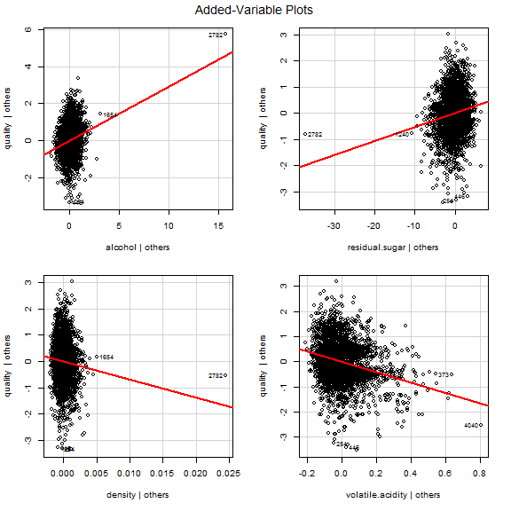

```r
> #id.n - identify n most influential observations
> #id.cex - controls the size of the dot
```


```r
> # run the qq-plot
> qqPlot(RegModel.5, id.n=3)
```


```
446 254 741 
  1   2   3 
```

```r
> # here, id.n identifies the n observations with the largest residuals in absolute value
```

The distribution may have a slight left skew but is overall normal.  Hooray!


```r
> #run Bonferroni test for outliers
> outlierTest(RegModel.5)
```

```

No Studentized residuals with Bonferonni p < 0.05
Largest |rstudent|:
     rstudent unadjusted p-value Bonferonni p
446 -4.393978          1.139e-05     0.050536
```

```r
> outlierTest(RegModel.4)
```

```
      rstudent unadjusted p-value Bonferonni p
4746 -5.205094         2.0267e-07   0.00089926
```

The Bonferonni p-value remains significant, indicating the model is sound even taking into account the significant error of using multiple predictor variables. 


```r
> #identify highly influential points
> influenceIndexPlot(RegModel.5, id.n=3)
```

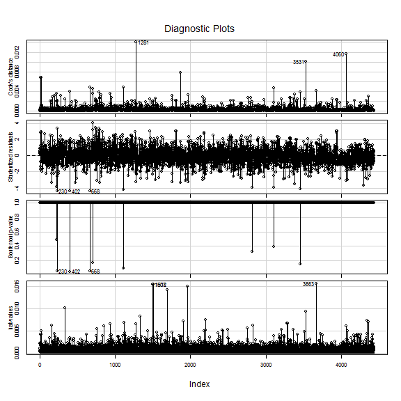
There do appear to be some influential outliers, especially 2539 based on a quick review.


```r
> #make influence plot
> influencePlot(RegModel.5, id.n=3)
```


```
        StudRes          Hat        CookD
254  -4.3831269 0.0004920347 0.0018837644
446  -4.3939775 0.0010093065 0.0038852329
741  -4.3824499 0.0012171019 0.0046616471
1418 -3.3201565 0.0053968759 0.0119359951
2155 -0.2560041 0.0135329315 0.0001798559
2782  1.7169603 0.2071876281 0.1540114667
4040 -1.1556548 0.0155982500 0.0042321095
4481 -3.0993340 0.0060284325 0.0116293305
```

```r
> # diameter is related to cooks distance
```
Again observation 2539 appears to be a largely influential outlier.  I would consider taking this point out and seeing if the model still fits.  


```r
> #attempting to take out point 2539
> White_wines.train <- White_wines.train[-c(2539), ]
> 
> #re-run model with delted row
> RegModel.5 <- 
+   lm(quality~alcohol+residual.sugar+density+volatile.acidity,
+    data=White_wines.train)
> summary(RegModel.5)
```

```

Call:
lm(formula = quality ~ alcohol + residual.sugar + density + volatile.acidity, 
    data = White_wines.train)

Residuals:
    Min      1Q  Median      3Q     Max 
-3.3455 -0.5042 -0.0342  0.4784  3.1387 

Coefficients:
                   Estimate Std. Error t value Pr(>|t|)    
(Intercept)       81.636687  13.690405   5.963 2.67e-09 ***
alcohol            0.277088   0.020164  13.742  < 2e-16 ***
residual.sugar     0.055319   0.005369  10.303  < 2e-16 ***
density          -78.923480  13.621729  -5.794 7.35e-09 ***
volatile.acidity  -2.062296   0.114731 -17.975  < 2e-16 ***
---
Signif. codes:  0 '***' 0.001 '**' 0.01 '*' 0.05 '.' 0.1 ' ' 1

Residual standard error: 0.7631 on 4431 degrees of freedom
  (1 observation deleted due to missingness)
Multiple R-squared:  0.2619,	Adjusted R-squared:  0.2612 
F-statistic: 393.1 on 4 and 4431 DF,  p-value: < 2.2e-16
```

```r
> #re-run influence plot
> influencePlot(RegModel.5, id.n=3)
```


```
        StudRes          Hat       CookD
254  -4.3877294 0.0004964299 0.001904575
446  -4.3955582 0.0010094304 0.003888491
741  -4.3697961 0.0012804600 0.004876462
1418 -3.2633207 0.0065836691 0.014084502
1654  0.7842392 0.0154641543 0.001932233
1664  0.7842392 0.0154641543 0.001932233
3902 -2.3306951 0.0092701520 0.010155430
4040 -1.1457989 0.0156324928 0.004169530
4481 -3.0838333 0.0061177069 0.011685094
```

It does appear that removing observation 2539 does make a difference.  Now there are more outliers but the significance of the point is removed without greatly affecting the F-statistic and p-value.  

Now I will use a Breusch–Pagan test for heteroscedasticity.


```r
> #test for heteroskedasticity
> ncvTest(RegModel.5)
```

```
Non-constant Variance Score Test 
Variance formula: ~ fitted.values 
Chisquare = 31.0965    Df = 1     p = 2.455132e-08 
```
This indicates (I think) that overall the data has heteroskedasticity. 

Finally I will look at the degree of multicollinearity present among variables.  I was initially hypothesizing there was at least some multicollinearity between some variables simple based on their names and the distribution of data.  I will first run Model #2 to see how much was present when all significant variables were included in the model.  


```r
> vif(RegModel.2)
```

```
            alcohol             density       fixed.acidity 
           7.337050           25.279774            2.543620 
free.sulfur.dioxide                  pH      residual.sugar 
           1.152135            2.083031           11.620522 
          sulphates    volatile.acidity 
           1.126626            1.060065 
```

Hypothesis confirmed.  There was defiantly multicolleniarty issues in the first model.  Now let me look at the final model.  


```r
> vif(RegModel.5)
```

```
         alcohol   residual.sugar          density volatile.acidity 
        4.671893         5.491635        12.063016         1.014919 
```
Better! There is still a sight issues but on the whole they seem to be independent variables.  

So overall the model building process has showing we can use the variables percent alcohol, the amount of residual sugar, wine density and wine volatile acidity to predict the level of quality (or for our purposes preference) that will be given to a certain wine by a drinker.  I chose these specific variables through comparing multiple models for the best fit while maintaining parsimony.


